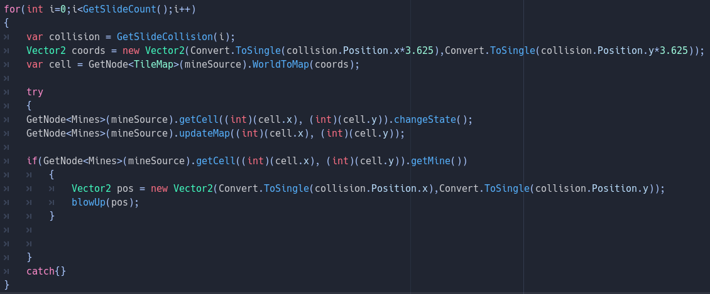

# Mazesweeper

> Par Larry-Félix Paquette

Mazesweeper est un jeu de puzzle/roguelike où l'on contrôle un personnage dans un tableau de Démineur. Le but est de ce rendre de l'autre côté du tableau sans mourir des mines. Certaines règles standard de Démineur sont enlevé, comme le fait que les 0 ne révèlent pas les cases autours, dans le but d'accroitre un peu la difficulté et le réalisme du jeu. Il y a un système de dégat afin de ne pas trop punir les joueurs et afin de permettre l'implémentation d'une "partie infinie" et d'autres fonctions à venir. Le jeu est un peu inspiré du concept de Demoncrawl, mais implémenté pour avoir un jeu plus actif.

## Génération aléatoire

Le jeu utilise une fonction de base pour générer les mines dans le tableau, utilisant deux boucles for inbriquées pour la génération. Il y a une vérification pour que les tableaux aient certaines cases toujours vides afin de ne pas placer le joueur dans une situation de devinette où il n'y a pas de choix logique pour continuer. Bien sur, de telle situation peuvent occrurer dans une partie, mais il n'est pas désirable de commencer sur une telle situation. Certains aspect qu'il y aurait à ajouter serait l'ajout d'obstacles ou de bonus sur le chemin, ce qui n'a pas été implémenté encore dû à la difficulté que j'ai encontrer pour parler entres plusieurs nodes séparée initiallement.

## Détection de collision

Chaques cases possèdent une hitbox de collision, et lorsque le joueur touche à cette hitbox, j'utilise la fonction GetSlideCount et GetSlideCollision afin de savoir quel case à été touchée. Une fois que la case à été trouvée (en convertissant la coordonnée avec une compatible avec le tableau puisque l'image des cases on été réduite en taille, modifiant leurs positions), il y a une vérification pour savoir si il s'agit d'une mine en comparant la case trouvée avec la cellule dans le tableau (puisque je ne reçoit pas la mine elle-même, mais la position dans le tableau). L'implémentation n'est pas très bonne, et possède un bug où il est possible de se prendre 2 coups sur une seule mine, et la vérification ne fonctionne que sur les mines, et un try-catch est requis pour ne pas avoir un crash si une collision avec une case hors-champ occure.

